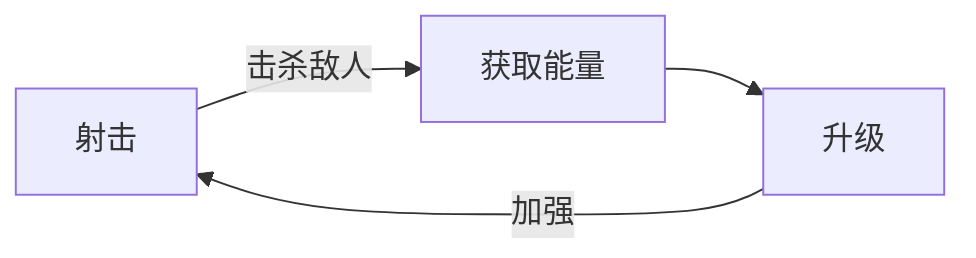
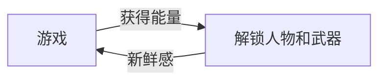
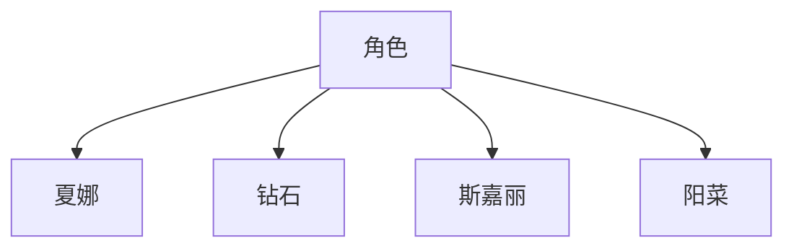
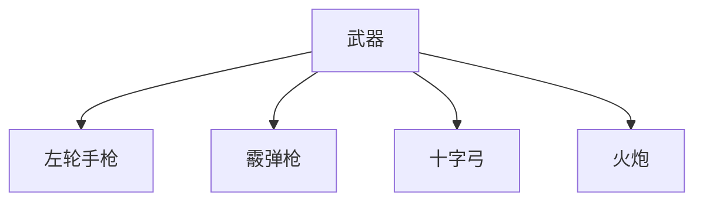

#拆解 #体验
 # **游戏名称**
---------------------------
10 Minutes Till Dawn

# **游戏类型**
---------------------------
## 核心
射击，Rouguelike

## 内循环

## 外循环

**游戏玩法**
角色+武器，伴随有限的可视度。在十分钟的怪物攻击下活下来，敌人会在期间不断加强
### 角色种类

| 姓名   | HP  | 技能                                                                                                             |
| ------ | --- | ---------------------------------------------------------------------------------------------------------------- |
| 夏娜   | 3   | 每升一次等级拥有一次重置技能选项的机会                                                                           |
| 钻石   | 6   | 高血量                                                                                                           |
| 斯嘉丽 | 2   | 每三次攻击释放一次能穿透敌人的火凤凰，给敌人施加燃烧状态，每秒-3                                                 |
| 阳菜   | 2   | 鼠标右键可召唤一个固定间隔攻击敌人的分身，攻击力等同于武器攻击力，同时在期间如果移动则会产生一次没有无敌帧的冲刺 |

![[TMTDcharacter1.png]]
![[TMTDcharacter2.png]]
![[TMTDcharacter3.png]]
![[TMTDcharacter4.png]]
## 角色评价：
- 新手角色阳菜,中规中矩的血量，因为Rouge的
核心是**随机**和**Build**,技能保证了更快的构筑
- 钻石角色代表**高容错**，血量相比初始角色翻倍，手残党的福音
> 个人认为较为目前的游戏开发情况下该角色有些过强，稍微小心一点就可以养成一个套路，非常容易通关，至少削弱一点血会合适一些
- 斯嘉丽，功能特化的角色之一，技能看起来非常契合武器火炮，但是个人体验下来，她更适配的是**高射速武器**，火炮的配合反而相对平庸，不过既能穿刺又能上状态，成长上限还是有的，不过两滴血还是容错太低了
- 阳菜，目前唯一拥有**位移技能**的角色，非常强的玻璃大炮，技能有较强辅助性，因为目前没有太多的构筑可以配合分身，闪避的意义大于分身，开局如果拿到攻击力的构筑加上十字弓可以秒怪

### 武器种类

| 武器名   | Damage | FireRate | Projectiles | Ammo | ReloadTime |
| -------- | ------ | -------- | ----------- | ---- | ---------- |
| 左轮手枪 | 14     | 4.0      | 01          | 06   | 1.0        |
| 十字弓   | 20     | 4.0      | 01          | 01   | 1.0        |
| 霰弹枪   | 12     | 5.0      | 04          | 02   | 1.0        |
| 火炮     | 2.5    | 2.5      | 01          | 12   | 1.4        | 
![[TMTDweapon1.png]]
![[TMTDweapon2.png]]
![[TMTDweapon3.png]]
![[TMTDweapon4.png]]
## 武器评价：
- 新手武器左轮，标准身材，两三发子弹干掉一个敌人，节奏合适，方便熟悉游戏
- 十字弓，召唤流派指定武器，攻击力最强，只要加上一层攻击力天赋就可以移动时秒杀敌人，开始能够穿透一个怪物
- 霰弹枪，输出暴君，就是手短，和所有流派都有较高契合度，除了召唤
- 火炮，成型最慢的武器，射速慢伤害低，但是加上异常状态和分裂之后也不失为超级强力的武器，效率甚至可以接近全自动的召唤流
>如果简单对所有数据相加(无权重)，可以看到十字弓是最高的，可以简单当作武器强度的参考

### 天赋种类
游戏每次升级可获得一次选择天赋的机会
我将其粗略的分为
**攻击**：
1. 直接增伤类(子弹，召唤，效果)
2. 攻速
3. 状态(火伤，冰暴)
4. 召唤(鬼魂，镰刀等)

**辅助**：
1. 换弹速度
2. 子弹数量
3. 移速加成
4. 状态(冰冻)

**防御**：
1. 血量增强
2. 护盾

以此衍生出的流派我简单的归纳为
- 攻击力核心
- 攻速核心
- 状态核心
- 召唤核心
> 需要说明的是后期角色成长起来之后无论是什么流派都可以走，水桶角色

攻击力在于一条单独的天赋线，主要核心天赋是
![[TMTDskill1.png]]
提高攻击力的同时加上穿透，清怪必要，游戏主要是以堆怪为主，所以归根结底还是要考量角色的对群能力，攻击力核心和任何其他核心都可以搭配，泛用性很高 ,十字弓吃加成很高

攻速对霰弹更友好，其核心其实是后期一个怪物所掉落的特殊奖励，主要利用分裂加子弹数量达成高输出
![[TMTDskill2.png]]

状态流，火焰和雷电打伤害，冰冻打控制，都可以叠加，特别是火焰伤害，每次伤害单独计算，累计伤害客观，基本让怪物可以无法近身，冰冻中的百分比伤害更是非常的无解，加上最后的爆炸还会产生连锁反应

召唤核心遗世独立，目前的主要输出必须是镰刀天赋，配合加攻速和伤害，直接全自动，最后怪物boss掉落的天赋也是核心之一，其余召唤物相关尽可能点就好，主要是伤害和召唤物攻速
> 私以为目前召唤流派没开发完全，还有很多拓展空间，如果没有镰刀，其余召唤物的输出确实乏善可陈
![[TMTDskill3.png]]

### 怪物种类
![[TMTDmonster1.png]]
游戏中的普通怪物，章鱼和自爆怪，前者就是韭菜，只有简单的目标追踪和转向，后者靠近玩家一定距离会自爆
![[TMTDboss1.png]]
前期的强化版章鱼boss，抗击退，速度更快血量更高，死亡后会掉落一个随机天赋宝箱
![[TMTDboss2.png]]
后期boss，会加速冲撞玩家，有惯性，血量非常厚，同时伴随着五分钟会出现一个矩形界限包围玩家，无法离开，但它可以自由移动，死亡后掉落三选一的强大天赋，有一定副作用
![[TMTDskill4.png]]

后期会短暂出现的怪物，能够发射远程子弹射击玩家
![[TMTDmonster2.png]]

# 总评
对于一个试玩版游戏来说，系统十分完整并且耐玩，游戏节奏把控较好，出怪也是慢快慢快，难度递增，同时让玩家体会到割草的快感，但是当前怪物和天赋种类等较少，只有十分钟的游戏也限制的游玩时间和作为Rougue的可重复游玩性，期望完整版